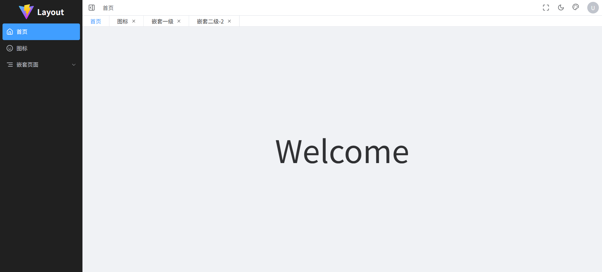
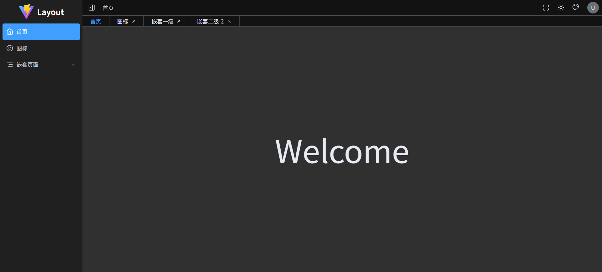

# Vue3 Layout

## 简介

提供常见的后台关系系统的布局，不含鉴权等附加功能。

## 技术栈

- [Vue3](https://vuejs.org/)
- [Vite](https://vite.dev/)
- [ElementPlus](https://element-plus.org/zh-CN/)
- [UnoCSS](https://unocss.dev/)

## 预览

